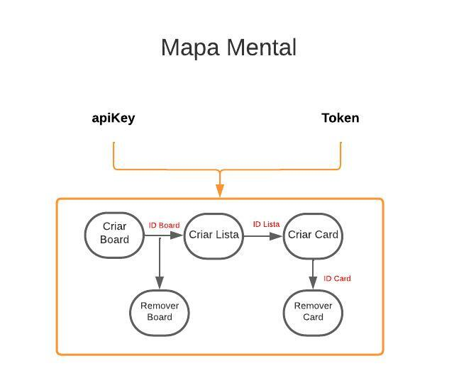

## Teste Automação Trello

## Índice

1. [Visão Geral](#visao-geral)
2. [Dependências](#dependencias)
3. [Setup](#setup)
4. [Modo de uso](#modo-de-uso)

## Visão Geral

Repositório para automação da API do Trello

## Dependências

- [nodejs 8+](https://nodejs.org/en) Arquitetura assíncrona e orientada por eventos

## Setup

- `npm install`

## Modo de uso

- Comandos para execução:
    - `npx cypress open` ou `npx cypress run`
